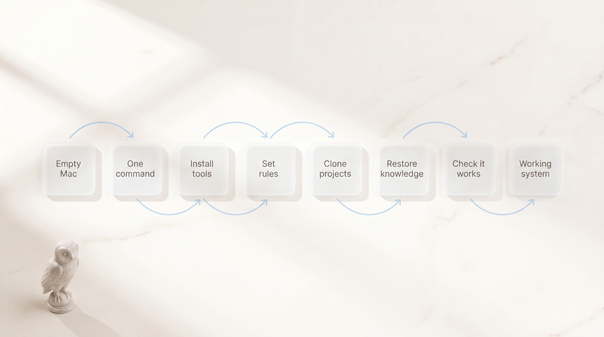
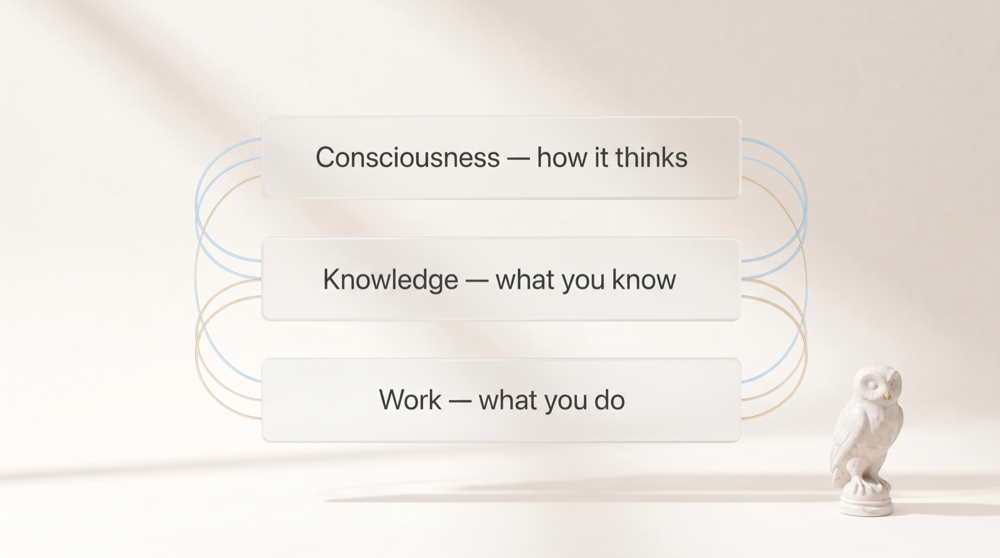
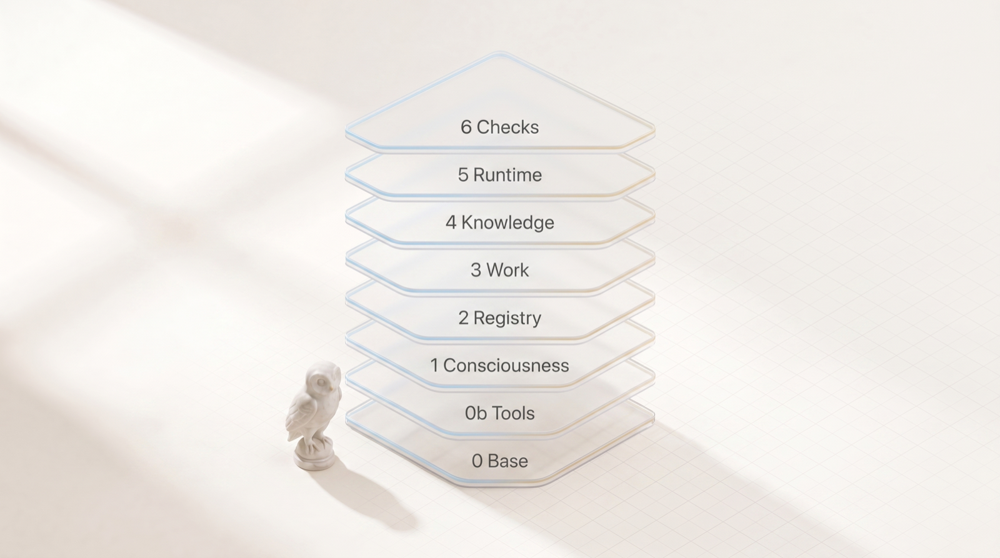
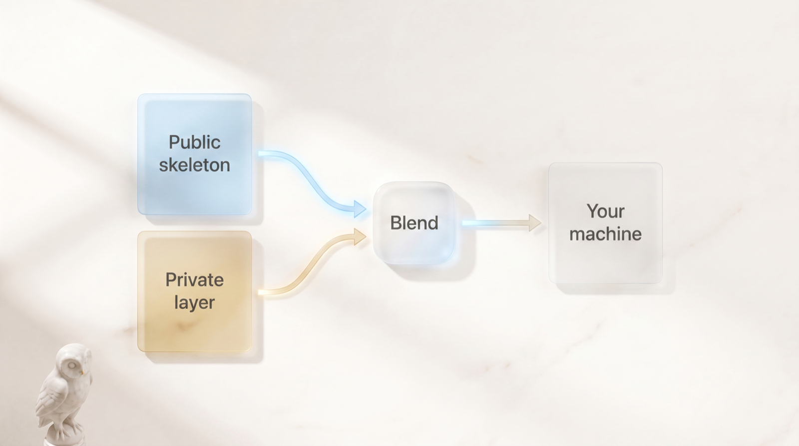
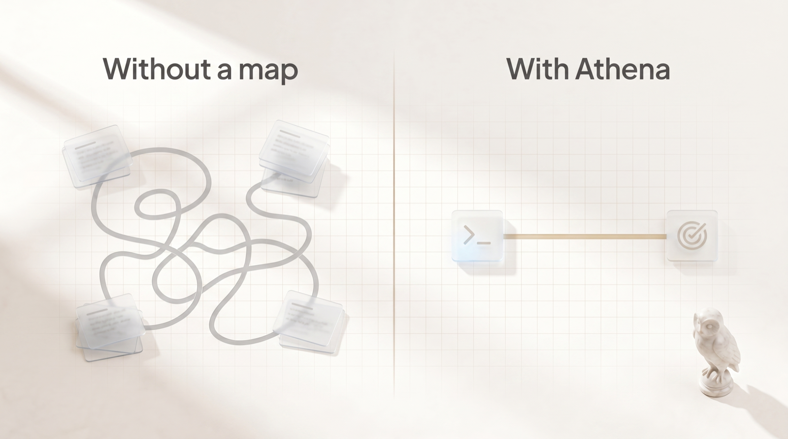

<p align="center">
  
</p>

<h1 align="center">Athena</h1>

<p align="center">
  <strong>Set up your entire AI workspace on a brand-new Mac with one command.</strong><br>
  From the rules your assistant follows to the live tools it runs — rebuilt in minutes, identically, every time.
</p>

<p align="center">
  🇬🇧 English · <a href="README.ru.md">🇷🇺 Русский</a>
</p>

---

```bash
git clone <repo> ~/Проекты/athena && cd ~/Проекты/athena
cp athena.config.example.sh athena.config.sh   # fill in your repos / values
./bootstrap.sh                                   # or --dry-run to preview
```

That's the whole setup. No long checklist, nothing to forget, no two machines that mysteriously behave differently.

---

## What is this, really?

A modern AI assistant is only as good as the workspace around it — the rules it follows, the habits it has, the projects it can see, the notes it can recall, the tools it can reach. Build that workspace by hand and it slowly sprawls into hundreds of small files scattered across your machine. Then you buy a new Mac, and you get to rebuild all of it from memory. It never comes out quite the same.

**Athena packs that whole workspace into a single, repeatable recipe.** Run one command and it lays everything back down in the right order: the tools, the rules, the projects, the knowledge, the background helpers. Like restoring a phone from a backup — but for your entire way of working with AI.

It isn't built from scratch on a hunch. Athena stands on proven ideas from people who do this seriously:

- The **Knowledge** part follows the *synthesis-on-write* approach popularized by **Andrej Karpathy** — you don't just dump notes, you distill them as you save, so what you keep is genuinely useful later.
- The **setup** is driven by [**chezmoi**](https://www.chezmoi.io/), the well-known dotfile manager, so your configuration is versioned and portable instead of hand-copied.
- The whole thing is **idempotent** — a fancy word for *safe to run again and again*. It converges to the same result; it never piles up duplicates.

The payoff is simple: a correct system, stood up from zero in minutes, that keeps supporting your work — and quietly **saves you tokens** every day (more on that below).

---

## What happens when you run it

<p align="center">
  
</p>

You start with an empty Mac and type one command. Athena does the rest, step by step — every step automatic, ordered, and checked. If anything fails to start, the run stops and tells you; you never end up with a half-built machine that pretends it's fine.

<p align="center">
  
</p>

---

## The big idea: three planes, never mixed

<p align="center">
  
</p>

Everything you own lives in exactly one of three "planes." Keeping them apart is what stops the mess: temporary clutter never pollutes your rules, secrets never touch your code, and notes never get lost inside project folders.

<p align="center">
  
</p>

| Plane | In plain terms | Where it lives |
|---|---|---|
| **Consciousness** | how your assistant thinks and behaves | `~/.claude` · `~/.codex` · `~/.agents` |
| **Knowledge** | your personal, distilled library | `~/Мозг` |
| **Work** | your actual projects and files | `~/Проекты` · `~/Хранилище` · `~/Архив` |

The rules for *what goes where* live inside the system itself, so it grows tidily instead of turning into a junk drawer.

---

## How it builds: six calm layers

<p align="center">
  
</p>

The setup script builds your machine from the ground up in ordered layers — like assembling floors of a building. Each layer is safe to repeat, and you can run just one if you want.

<p align="center">
  
</p>

| Layer | What it sets up |
|---|---|
| **0 · Base** | the core command-line tools (`claude`, `codex`, `git`, `node`, `python`…) |
| **0b · Tools** | extra tools like bots, placed before the rules so they can wire themselves up |
| **1 · Consciousness** | your assistant's rules, habits, and helpers |
| **2 · Registry** | a searchable map of every skill and tool, so the right one is found fast |
| **3 · Work** | clones and installs your projects |
| **4 · Knowledge** | restores your personal library |
| **5 · Runtime** | secrets (kept in the macOS Keychain) and background helpers |
| **6 · Checks** | runs final checks to prove the whole thing actually works |

```bash
./bootstrap.sh --only=1     # run a single layer
./bootstrap.sh --dry-run    # show everything, change nothing
```

---

## Share the structure, keep your secrets

<p align="center">
  
</p>

Here's the tricky part of sharing a personal setup: the *structure* is worth opening up, but the *contents* — your secrets, your private notes — are not. Athena solves it by blending two sources at setup time: a **public** skeleton (this repo) and your own **private** layer. They merge into one, and your private layer always wins.

<p align="center">
  
</p>

- Skip the private layer → you still get a complete, working **public-only** setup.
- Add it → your personal details are layered in on top.
- A built-in guard **fails the build** if any personal data ever slips into a public file. The boundary is enforced, not just hoped for.

This repository is the **public skeleton**. It contains zero personal data — no secrets, no private content, no hardcoded paths.

---

## Why it saves you tokens

<p align="center">
  
</p>

Every time an AI assistant has to rediscover its own tools, re-read scattered instructions, or wander around looking for the right skill, it burns tokens — and tokens are money and time. Athena gives the assistant a **tidy index of everything it can do**, so it walks straight to the right tool instead of searching.

<p align="center">
  
</p>

Less wandering means fewer tokens spent on overhead and more spent on your actual problem. The structure does the remembering, so the assistant doesn't have to.

---

## Why it's efficient (in short)

- **One command, idempotent.** Nothing to skip or misremember; re-running converges instead of duplicating.
- **Fail-closed.** A half-finished setup never reports success — if something doesn't start, the run fails loudly.
- **Provable.** Built-in checks confirm both assistants see the same tools, every helper is valid, and no personal data leaked.
- **Token-aware by design.** The tool map routes to the right capability first, so reasoning goes to the task, not to overhead.
- **Tidy as it grows.** Clear rules for what-goes-where keep the system legible for years.

---

## What's in the repo (and what isn't)

| In the repo (safe to share) | **Not** in the repo |
|---|---|
| the setup script, tool list, checks | secret **values** (Keychain / `~/.secrets`) |
| layout rules, skills, helpers | your private notes (your own repo) |
| config templates, a project starter | your personal config & project list |

A personal instance = your filled-in config + your private layer, on top of this public skeleton.

---

## Commands

```bash
shellcheck bootstrap.sh smoke/*.sh   # lint
./bootstrap.sh --dry-run             # dry run (preview, change nothing)
./bootstrap.sh --only=<0|0b|1..6>    # run a single layer
smoke/smoke.sh                       # final checks
```

**Go deeper:** [`docs/FEATURES.en.md`](docs/FEATURES.en.md) documents every function in detail. See [`specs/`](specs/) for the plan, [`docs/decisions/`](docs/decisions/) for architecture decisions, and [`CLAUDE.md`](CLAUDE.md) for the map.

---

<p align="center"><sub>Athena — goddess of wisdom and strategy. Your system, made portable.</sub></p>
