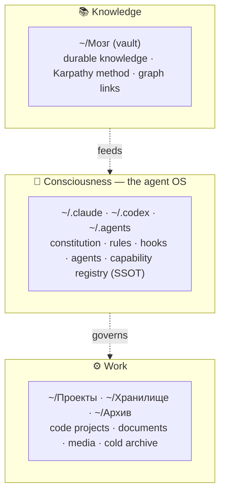
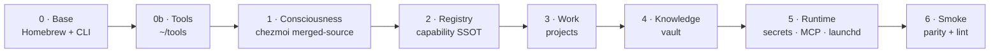
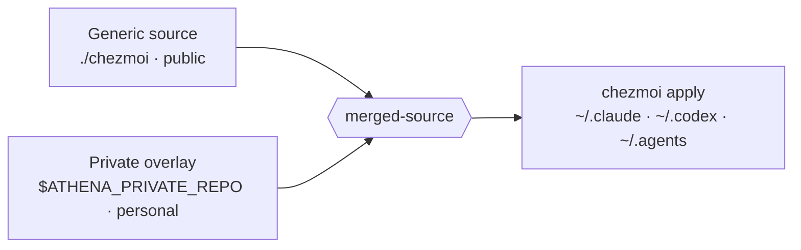

<p align="center">
  
</p>

<h1 align="center">Athena</h1>

<p align="center">
  <strong>A portable agent operating system.</strong><br>
  A clean Mac → <strong>one command</strong> → your entire system: from the <code>CLAUDE.md</code> cascade to the live runtime.
</p>

<p align="center">
  🇬🇧 English · <a href="README.ru.md">🇷🇺 Русский</a>
</p>

---

```bash
git clone <repo> ~/Проекты/athena && cd ~/Проекты/athena
cp athena.config.example.sh athena.config.sh   # fill in your repos / values
./bootstrap.sh                                   # or --dry-run
```

That is the whole onboarding. No manual setup, no checklist to forget, no drift between machines.

---

## Why this exists

An AI agent is only as good as the system around it — its constitution, rules, hooks, capability registry, the projects it can see, the knowledge it can recall. Over months that system grows into hundreds of files spread across `~/.claude`, `~/.codex`, `~/.agents`, project folders, a knowledge vault, launch agents, and secrets.

That growth creates three quiet failures:

1. **Non-portability.** A new Mac means days of manual re-setup, and the result never quite matches the old machine.
2. **Drift.** Two machines slowly diverge; what works on one breaks on the other.
3. **Leak risk.** Personal data and secrets get tangled into the same tree you would otherwise want to share or open-source.

Athena turns that entire system into **one reproducible artifact**. The public scaffold lives here. Your personal layer lives in a private overlay. One idempotent script reassembles both into a working machine — every time, identically.

> This repository is the **generic, public scaffold**. It contains zero personal data: no `/Users/...` hardcodes, no secrets, no private content. Everything personal is injected at deploy time from a private overlay (see [Generic ⊕ private](#generic--private)).

---

## Three planes — never mixed

<p align="center">
  
</p>

Everything you own falls into exactly one of three planes. Keeping them separate is what makes the system legible as it grows — runtime junk never pollutes canon, secrets never touch code, knowledge never scatters into project folders.



| Plane | Home | What lives there | Managed by |
|---|---|---|---|
| **Consciousness** | `~/.claude` · `~/.codex` · `~/.agents` | constitution, rules, hooks, agents, registry SSOT | chezmoi |
| **Knowledge** | `~/Мозг` | durable knowledge (Karpathy method), private repo | private vault repo |
| **Work** | `~/Проекты` · `~/Хранилище` · `~/Архив` | projects, documents, media | per-project git |

The layout rules live **inside** the system: [`rules/structure.md`](rules/structure.md) (the declarative source of truth), the `organize` skill (the procedure), and a PreToolUse hook (the hard invariant). The system grows along them instead of into chaos.

---

## Six layers of deployment

<p align="center">
  
</p>

`bootstrap.sh` is an orchestrator. It builds the machine bottom-up in ordered, independently runnable layers. Each layer is idempotent: run it once or a hundred times, the result is the same.



| Layer | Name | What it does |
|---|---|---|
| **0** | Base | Homebrew + CLI (`claude`, `codex`, `gh`, `node`, `python`, `uv`, `ffmpeg`) — from `Brewfile` |
| **0b** | Tools | external tools → `~/tools` (bots etc.), cloned **before** Consciousness |
| **1** | Consciousness | chezmoi deploys `~/.claude` · `~/.codex` · `~/.agents` from the merged source |
| **2** | Registry | `build_registry` → `capability-plan` SSOT |
| **3** | Work | clone + install projects from `projects.manifest` |
| **4** | Knowledge | clone the private vault repo |
| **5** | Runtime | `~/.secrets` (Keychain) · MCP reauth · launchd agents |
| **6** | Smoke | Claude = Codex parity + structure lint |

```bash
./bootstrap.sh --only=1     # run a single layer
./bootstrap.sh --dry-run    # show everything, change nothing
```

---

## Generic ⊕ private

<p align="center">
  
</p>

The hardest problem in sharing a personal system is the boundary: the structure is worth open-sourcing, the contents are not. Athena solves it with a **merged source**. Layer 1 rsyncs the generic base, lays the private overlay on top (overlay wins on conflict), then runs a single `chezmoi apply`.



- Leave `ATHENA_PRIVATE_REPO` empty → a valid **generic-only** deploy.
- Set it → your `references/`, active launch agents, and secret generators are layered in.
- A `PERSONAL_RE` smoke gate fails the build if personal data ever lands in a tracked public file. The boundary is enforced, not hoped for.

See the architecture decision: [`docs/decisions/0001-merged-source-generic-private.md`](docs/decisions/0001-merged-source-generic-private.md).

---

## Why it's efficient

- **One command, idempotent.** No manual steps to skip or misremember. Re-running converges instead of duplicating; launch agents are only reloaded when their plist actually changed (no flicker).
- **Fail-closed runtime.** Layer 5 counts loaded vs. failed launch agents and exits non-zero on any failure — a half-deployed machine never reports success.
- **Provable parity.** Layer 6 smoke verifies Claude and Codex see the same registry, every plist is valid, every guard hook actually blocks secrets, and no personal data is tracked.
- **Token economy by design.** A capability registry (SSOT) routes the right skill/agent/MCP quality-first, so the agent spends reasoning on the task, not on rediscovering its own tools.
- **Self-describing growth.** Layout rules, the `organize` skill, and a hard hook keep expansion legible; the constitution stays a lean router, not a junk drawer.

---

## Generic vs personal

| In the repo (publishable) | **Not** in the repo |
|---|---|
| `bootstrap.sh`, `Brewfile`, `smoke/` | secret **values** (Keychain / `~/.secrets`) |
| `rules/structure.md`, skills, `launchd/` | vault content (your private repo) |
| `chezmoi/` templates, `claude-starter/` | `athena.config.sh`, `projects.manifest` |

A personal instance = a filled-in `athena.config.sh` + a private chezmoi overlay on top of this generic scaffold.

---

## Commands

```bash
shellcheck bootstrap.sh smoke/*.sh   # lint
./bootstrap.sh --dry-run             # dry run
./bootstrap.sh --only=<0|0b|1..6>    # single layer
smoke/smoke.sh                       # parity + structure smoke
smoke/dry-validate.sh                # template render validation (no chezmoi)
```

**Go deeper:** [`docs/FEATURES.en.md`](docs/FEATURES.en.md) documents every function in detail. Read [`specs/`](specs/) for the phased plan, [`docs/decisions/`](docs/decisions/) for architecture decisions, and the project [`CLAUDE.md`](CLAUDE.md) for the map.

---

<p align="center"><sub>Athena — goddess of wisdom and strategy. Your system, made portable.</sub></p>
