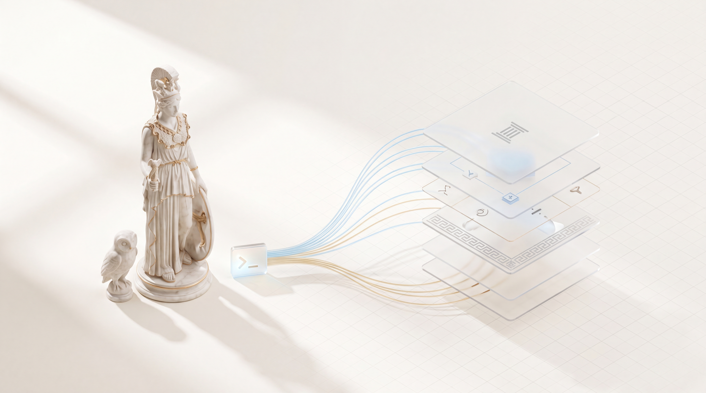
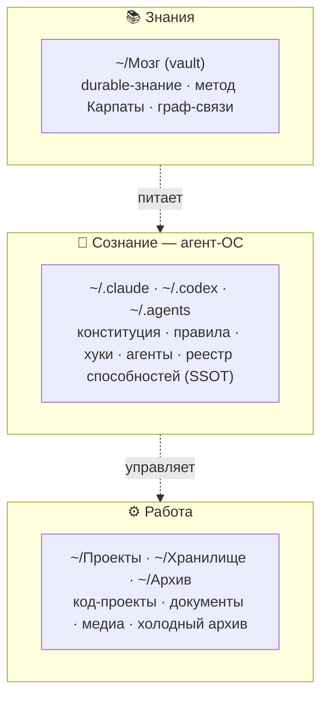
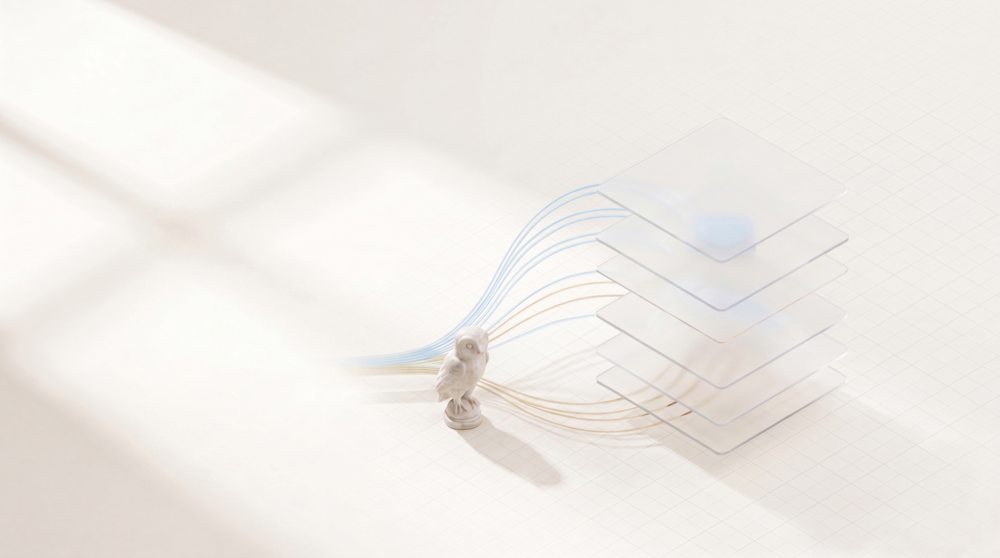
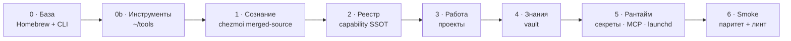
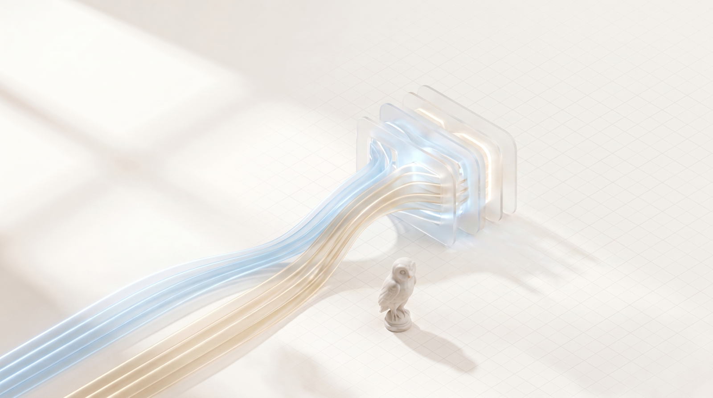
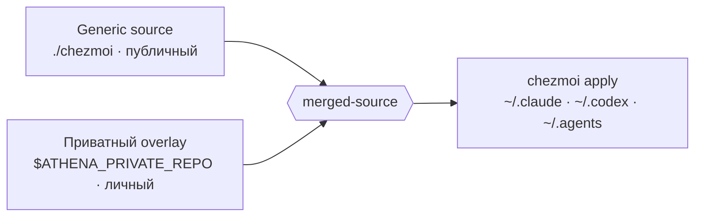

<p align="center">
  
</p>

<h1 align="center">Athena</h1>

<p align="center">
  <strong>Переносимая агентная операционная система.</strong><br>
  Чистый Mac → <strong>одна команда</strong> → вся твоя система: от каскада <code>CLAUDE.md</code> до боевого рантайма.
</p>

<p align="center">
  <a href="README.md">🇬🇧 English</a> · 🇷🇺 Русский
</p>

---

```bash
git clone <repo> ~/Проекты/athena && cd ~/Проекты/athena
cp athena.config.example.sh athena.config.sh   # впиши свои репо / значения
./bootstrap.sh                                   # или --dry-run
```

Это весь онбординг. Никакой ручной настройки, никакого чеклиста, который забудешь, никакого дрейфа между машинами.

---

## Зачем это нужно

AI-агент хорош ровно настолько, насколько хороша система вокруг него — конституция, правила, хуки, реестр способностей, видимые проекты, доступные знания. За месяцы эта система разрастается в сотни файлов по `~/.claude`, `~/.codex`, `~/.agents`, папкам проектов, vault знаний, launch-агентам и секретам.

Этот рост порождает три тихих отказа:

1. **Непереносимость.** Новый Mac = дни ручной пересборки, и результат всё равно не совпадает со старой машиной.
2. **Дрейф.** Две машины медленно расходятся; что работает на одной — ломается на другой.
3. **Риск утечки.** Личные данные и секреты сплетаются с тем же деревом, которым иначе хотелось бы делиться или открыть в open-source.

Athena превращает всю эту систему в **один воспроизводимый артефакт**. Публичный каркас живёт здесь. Личный слой — в приватном overlay. Один идемпотентный скрипт пересобирает оба в рабочую машину — каждый раз идентично.

> Этот репозиторий — **generic, публичный каркас**. Ноль личных данных: ни хардкода `/Users/...`, ни секретов, ни приватного контента. Всё личное вливается на этапе разворота из приватного overlay (см. [Generic ⊕ private](#generic--private)).

---

## Три плоскости — не смешивать

<p align="center">
  
</p>

Всё, чем ты владеешь, попадает ровно в одну из трёх плоскостей. Их разделение и делает систему читаемой по мере роста — рантайм-мусор не загрязняет канон, секреты не касаются кода, знания не растекаются по папкам проектов.



| Плоскость | Дом | Что внутри | Чем управляется |
|---|---|---|---|
| **Сознание** | `~/.claude` · `~/.codex` · `~/.agents` | конституция, правила, хуки, агенты, реестр SSOT | chezmoi |
| **Знания** | `~/Мозг` | durable-знание (метод Карпаты), приватный репо | приватный vault-репо |
| **Работа** | `~/Проекты` · `~/Хранилище` · `~/Архив` | проекты, документы, медиа | per-project git |

Правила раскладки живут **внутри** системы: [`rules/structure.md`](rules/structure.md) (декларативный источник истины), skill `organize` (процедура) и PreToolUse-хук (жёсткий инвариант). Система растёт по ним, а не в хаос.

---

## Шесть слоёв разворота

<p align="center">
  
</p>

`bootstrap.sh` — оркестратор. Он собирает машину снизу вверх упорядоченными, независимо запускаемыми слоями. Каждый слой идемпотентен: запусти раз или сто — результат тот же.



| Слой | Имя | Что делает |
|---|---|---|
| **0** | База | Homebrew + CLI (`claude`, `codex`, `gh`, `node`, `python`, `uv`, `ffmpeg`) — из `Brewfile` |
| **0b** | Инструменты | внешние инструменты → `~/tools` (боты и т.п.), клонятся **до** Сознания |
| **1** | Сознание | chezmoi разворачивает `~/.claude` · `~/.codex` · `~/.agents` из merged-source |
| **2** | Реестр | `build_registry` → `capability-plan` SSOT |
| **3** | Работа | clone + install проектов по `projects.manifest` |
| **4** | Знания | clone приватного vault-репо |
| **5** | Рантайм | `~/.secrets` (Keychain) · MCP reauth · launchd-агенты |
| **6** | Smoke | паритет Claude = Codex + линт структуры |

```bash
./bootstrap.sh --only=1     # один слой
./bootstrap.sh --dry-run    # показать всё, не менять ничего
```

---

## Generic ⊕ private

<p align="center">
  
</p>

Самая трудная задача при шеринге личной системы — граница: структуру открыть стоит, содержимое — нет. Athena решает её **merged-source**. Слой 1 rsync-ит generic-базу, накладывает приватный overlay сверху (overlay побеждает на конфликте), затем делает один `chezmoi apply`.



- Пусто `ATHENA_PRIVATE_REPO` → валидный **generic-only** разворот.
- Задан → твои `references/`, активные launch-агенты и генераторы секретов вливаются сверху.
- Smoke-гейт `PERSONAL_RE` валит сборку, если личные данные попадут в tracked публичный файл. Граница обеспечена, а не «на авось».

Архитектурное решение: [`docs/decisions/0001-merged-source-generic-private.md`](docs/decisions/0001-merged-source-generic-private.md).

---

## Почему это эффективно

- **Одна команда, идемпотентно.** Нет ручных шагов, которые пропустишь или забудешь. Повтор сходится, а не дублирует; launch-агенты перезагружаются только когда их plist реально изменился (без мигания).
- **Fail-closed рантайм.** Слой 5 считает загруженные vs упавшие launch-агенты и выходит с ненулевым кодом при любом сбое — полу-развёрнутая машина никогда не отрапортует «успех».
- **Доказуемый паритет.** Smoke слоя 6 сверяет, что Claude и Codex видят один реестр, каждый plist валиден, каждый guard-хук реально блокирует секреты, и ни одного личного данного в tracked.
- **Токен-экономия by design.** Реестр способностей (SSOT) роутит нужный skill/agent/MCP quality-first — агент тратит рассуждение на задачу, а не на переоткрытие собственных инструментов.
- **Самоописываемый рост.** Правила раскладки, skill `organize` и жёсткий хук держат расширение читаемым; конституция остаётся лин-роутером, а не свалкой.

---

## Generic vs личное

| В репо (публикуемо) | **НЕ** в репо |
|---|---|
| `bootstrap.sh`, `Brewfile`, `smoke/` | **значения** секретов (Keychain / `~/.secrets`) |
| `rules/structure.md`, skills, `launchd/` | контент vault (твой приватный репо) |
| шаблоны `chezmoi/`, `claude-starter/` | `athena.config.sh`, `projects.manifest` |

Личная инстанция = заполненный `athena.config.sh` + приватный chezmoi-overlay поверх этого generic-каркаса.

---

## Команды

```bash
shellcheck bootstrap.sh smoke/*.sh   # линт
./bootstrap.sh --dry-run             # сухой прогон
./bootstrap.sh --only=<0|0b|1..6>    # один слой
smoke/smoke.sh                       # паритет + структура
smoke/dry-validate.sh                # валидация рендера шаблонов (без chezmoi)
```

**Глубже:** [`docs/FEATURES.ru.md`](docs/FEATURES.ru.md) описывает каждую функцию детально. Читай [`specs/`](specs/) (фазовый план), [`docs/decisions/`](docs/decisions/) для архитектурных решений, и проектный [`CLAUDE.md`](CLAUDE.md) как карту.

---

<p align="center"><sub>Athena — богиня мудрости и стратегии. Твоя система, ставшая переносимой.</sub></p>
