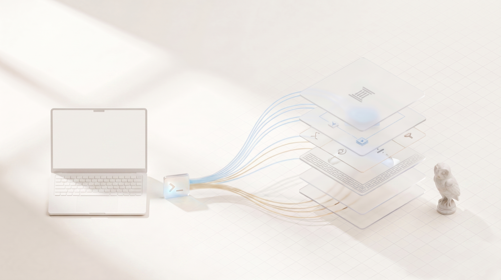
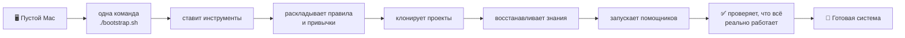
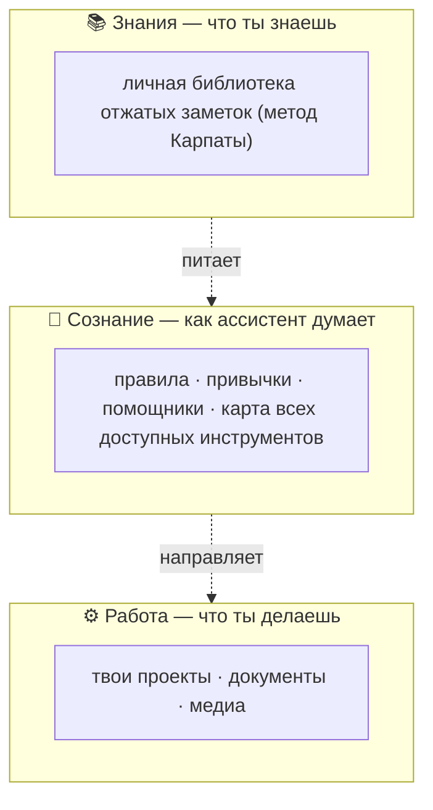
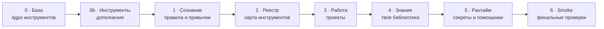
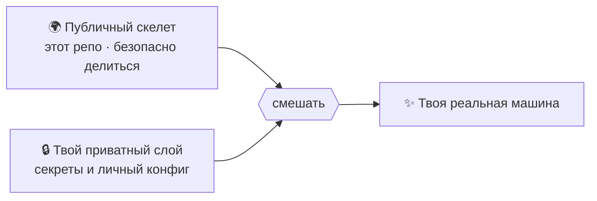
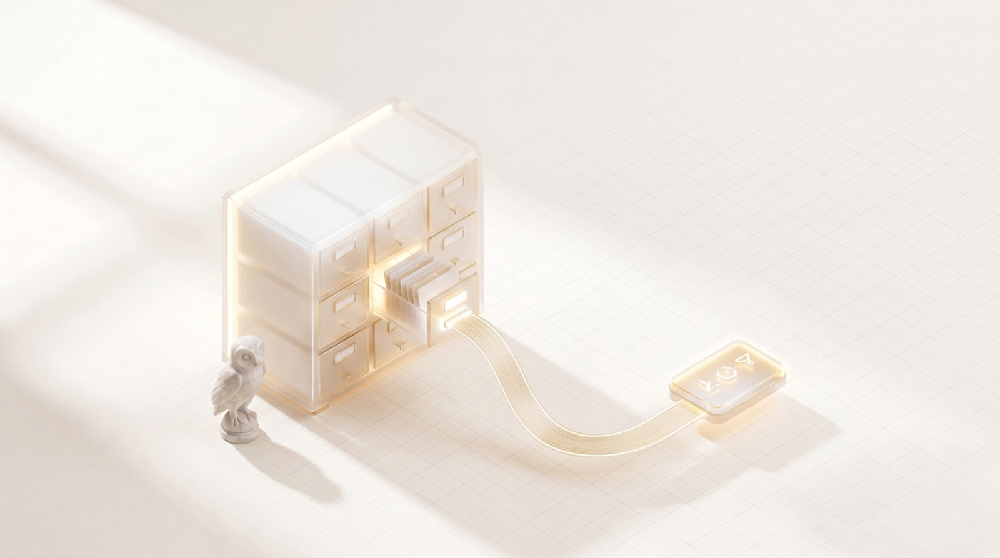
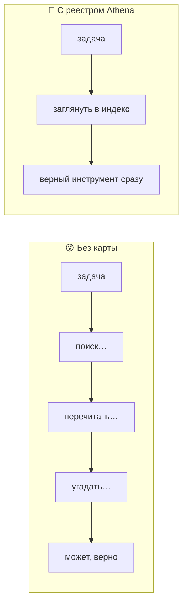

<p align="center">
  
</p>

<h1 align="center">Athena</h1>

<p align="center">
  <strong>Развернуть всё AI-окружение на новом Mac одной командой.</strong><br>
  От правил, которым следует твой ассистент, до живых инструментов, которые он запускает — пересобирается за минуты, идентично, каждый раз.
</p>

<p align="center">
  <a href="README.md">🇬🇧 English</a> · 🇷🇺 Русский
</p>

---

```bash
git clone <repo> ~/Проекты/athena && cd ~/Проекты/athena
cp athena.config.example.sh athena.config.sh   # впиши свои репо / значения
./bootstrap.sh                                   # или --dry-run для предпросмотра
```

Это вся настройка. Никакого длинного чеклиста, нечего забыть, и нет двух машин, которые загадочно ведут себя по-разному.

---

## Что это, простыми словами?

Современный AI-ассистент хорош ровно настолько, насколько хорошо окружение вокруг него — правила, которым он следует, привычки, проекты, которые он видит, заметки, которые помнит, инструменты, до которых дотягивается. Собери это окружение руками — и оно постепенно расползётся в сотни мелких файлов по всей машине. А потом ты покупаешь новый Mac и получаешь удовольствие собрать всё заново по памяти. И оно никогда не выходит точно таким же.

**Athena упаковывает всё это окружение в один повторяемый рецепт.** Запускаешь одну команду — и она раскладывает всё обратно в правильном порядке: инструменты, правила, проекты, знания, фоновые помощники. Как восстановить телефон из бэкапа — только это весь твой способ работать с AI.

Это собрано не на удачу. Athena опирается на проверенные наработки людей, которые делают это серьёзно:

- Часть **«Знания»** следует методу *синтеза-при-записи*, который популяризировал **Андрей Карпаты** — ты не сваливаешь заметки в кучу, а отжимаешь суть в момент сохранения, поэтому то, что остаётся, реально пригодится потом.
- **Настройку** ведёт [**chezmoi**](https://www.chezmoi.io/) — известный менеджер дотфайлов, поэтому конфигурация версионируется и переносится, а не копируется руками.
- Всё это **идемпотентно** — умное слово для *«можно запускать снова и снова без вреда»*. Оно сходится к одному результату и никогда не плодит дубли.

Выгода простая: правильная система, поднятая с нуля за минуты, которая дальше поддерживает твою работу — и тихо **экономит токены** каждый день (об этом ниже).

---

## Что происходит, когда ты запускаешь

<p align="center">
  
</p>

Ты начинаешь с пустого Mac и набираешь одну команду. Дальше Athena делает всё сама, шаг за шагом:



Каждый шаг автоматический, по порядку и с проверкой. Если что-то не поднялось — прогон останавливается и говорит об этом. Ты никогда не остаёшься с полусобранной машиной, которая делает вид, что всё в порядке.

---

## Главная идея: три плоскости, не смешивать

<p align="center">
  
</p>

Всё, чем ты владеешь, лежит ровно в одной из трёх «плоскостей». Их разделение и спасает от каши: временный мусор не пачкает правила, секреты не касаются кода, а заметки не теряются внутри папок проектов.



| Плоскость | Простыми словами | Где живёт |
|---|---|---|
| **Сознание** | как ассистент думает и ведёт себя | `~/.claude` · `~/.codex` · `~/.agents` |
| **Знания** | твоя личная отжатая библиотека | `~/Мозг` |
| **Работа** | твои настоящие проекты и файлы | `~/Проекты` · `~/Хранилище` · `~/Архив` |

Правила *что куда класть* живут внутри самой системы — поэтому она растёт аккуратно, а не превращается в свалку.

---

## Как собирается: шесть спокойных слоёв

<p align="center">
  
</p>

Скрипт настройки собирает машину снизу вверх упорядоченными слоями — как этажи здания. Каждый слой можно безопасно повторить, и при желании запустить только один.



| Слой | Что настраивает |
|---|---|
| **0 · База** | базовые CLI-инструменты (`claude`, `codex`, `git`, `node`, `python`…) |
| **0b · Инструменты** | дополнения вроде ботов, ставятся до правил, чтобы успеть подключиться |
| **1 · Сознание** | правила, привычки и помощники ассистента |
| **2 · Реестр** | поисковая карта всех навыков и инструментов — нужный находится быстро |
| **3 · Работа** | клонирует и ставит твои проекты |
| **4 · Знания** | восстанавливает личную библиотеку |
| **5 · Рантайм** | секреты (в Keychain macOS) и фоновые помощники |
| **6 · Smoke** | гоняет финальные проверки, что всё реально работает |

```bash
./bootstrap.sh --only=1     # один слой
./bootstrap.sh --dry-run    # показать всё, не менять ничего
```

---

## Делись структурой, храни секреты

<p align="center">
  
</p>

Вот в чём хитрость шеринга личной настройки: *структуру* открыть стоит, а *содержимое* — секреты, личные заметки — нет. Athena решает это, смешивая два источника при настройке: **публичный** скелет (этот репо) и твой **приватный** слой. Они сливаются в один, и приватный слой всегда побеждает.



- Пропусти приватный слой → всё равно получишь полноценную **публичную** настройку.
- Добавь → твои личные детали лягут сверху.
- Встроенный страж **валит сборку**, если личные данные хоть раз просочатся в публичный файл. Граница обеспечена, а не «на авось».

Этот репозиторий — **публичный скелет**. Ноль личных данных: ни секретов, ни приватного контента, ни захардкоженных путей.

---

## Почему это экономит токены

<p align="center">
  
</p>

Каждый раз, когда ассистент заново ищет свои же инструменты, перечитывает разбросанные инструкции или бродит в поисках нужного навыка — он жжёт токены. А токены — это деньги и время. Athena даёт ассистенту **аккуратный индекс всего, что он умеет**, и он идёт прямо к нужному инструменту, а не ищет.



Меньше блужданий — меньше токенов на накладные расходы и больше на твою настоящую задачу. Структура запоминает за ассистента, чтобы ему не приходилось.

---

## Почему это эффективно (коротко)

- **Одна команда, идемпотентно.** Нечего пропустить или забыть; повтор сходится, а не дублирует.
- **Fail-closed.** Полусобранная настройка никогда не отрапортует «успех» — если что-то не поднялось, прогон падает громко.
- **Доказуемо.** Встроенные проверки подтверждают: оба ассистента видят одни инструменты, каждый помощник валиден, личное не утекло.
- **Учитывает токены by design.** Карта инструментов ведёт к нужной способности сразу — рассуждение идёт на задачу, а не на накладные расходы.
- **Аккуратно растёт.** Чёткие правила «что куда» держат систему читаемой годами.

---

## Что в репо (и чего нет)

| В репо (безопасно делиться) | **Нет** в репо |
|---|---|
| скрипт настройки, список инструментов, проверки | **значения** секретов (Keychain / `~/.secrets`) |
| правила раскладки, навыки, помощники | твои личные заметки (твой репо) |
| шаблоны конфига, стартер проекта | твой личный конфиг и список проектов |

Личная инстанция = твой заполненный конфиг + твой приватный слой поверх этого публичного скелета.

---

## Команды

```bash
shellcheck bootstrap.sh smoke/*.sh   # линт
./bootstrap.sh --dry-run             # сухой прогон (предпросмотр, ничего не меняет)
./bootstrap.sh --only=<0|0b|1..6>    # один слой
smoke/smoke.sh                       # финальные проверки
```

**Глубже:** [`docs/FEATURES.ru.md`](docs/FEATURES.ru.md) описывает каждую функцию детально. Смотри [`specs/`](specs/) для плана, [`docs/decisions/`](docs/decisions/) для архитектурных решений, и [`CLAUDE.md`](CLAUDE.md) как карту.

---

<p align="center"><sub>Athena — богиня мудрости и стратегии. Твоя система, ставшая переносимой.</sub></p>
